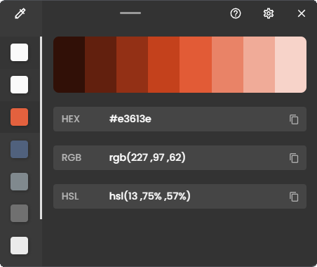

    
    <h1 align="center">Color Picker</h1>
    
A simple and  minimal color picker tool for desktop.

        

### Features

-   Pick a color with the zoomable Magnifier
-   Choose between multiple Color Formats
-   Let the Color History remember your last colors

# Contributors

# Installation

This application made using [ReactJs](https://reactjs.org/) and [Tauri](https://tauri.studio/).

## Dependencies

-   [Node Js](https://nodejs.org/en/)

### Installing Dependencies

    npm install

### Build the client

    npm build

### Build the Application

    npm run tauri build
